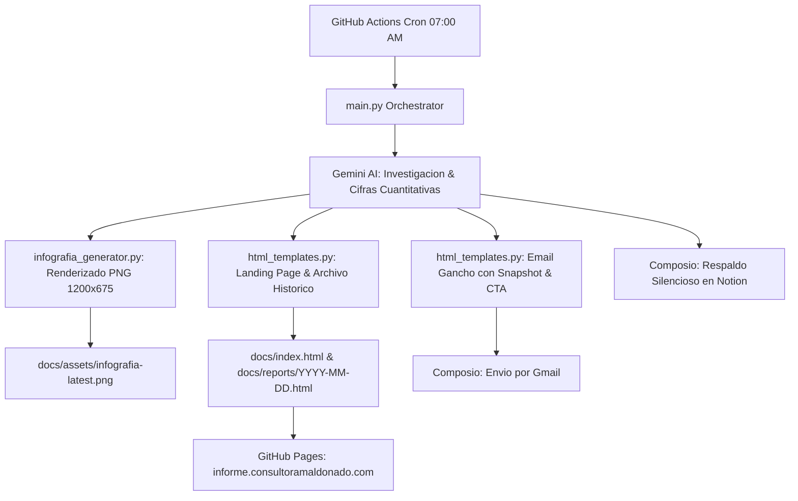

# 🇧🇴 Resumen Ejecutivo: Macroeconomía de Bolivia
### Consultora Maldonado — Plataforma Automatizada de Publicación y Análisis Financiero

Sistema integral en la nube que investiga la macroeconomía de Bolivia mediante Inteligencia Artificial con búsqueda en tiempo real (Google Gemini + Grounding Search), genera una **Infografía Visual Ejecutiva**, despliega una **Landing Page de Alto Rendimiento** (GitHub Pages / SEO) y envía un **Email Ejecutivo ("El Gancho")** con llamada a la acción hacia la web oficial todas las mañanas a las **07:00 a. m. (hora de Bolivia / UTC-4)**.

---

## 🏗️ Arquitectura del Sistema



---

## 🌟 Componentes y Canales de Publicación

| Componente | Formato | Propósito y Destino |
| :--- | :--- | :--- |
| **Infografía Visual** | Imagen PNG (1200x675 px) | Generada con `Pillow`. Tarjeta gráfica con KPIs, nivel de riesgo y paleta institucional de Consultora Maldonado. Se usa en el email y como `og:image` en redes. |
| **Landing Page Diaria** | HTML5 / CSS Vanilla / Schema.org | Publicada en `docs/` para **GitHub Pages** (`https://informe.consultoramaldonado.com`). Incluye análisis exhaustivo de deuda, bonos soberanos, selector histórico y SEO/GEO. |
| **Correo Gancho (Email)** | HTML Inline ultra-ligero | Enviado a `consultoramaldonado@gmail.com`. Incluye la infografía, Matriz TL;DR de alertas (🔴/🟡/🟢), 3 bloques snapshot y botón CTA para visitar la web. |
| **Respaldo Privado** | Notion Database API | Copia de seguridad estructurada en Notion en segundo plano sin costo. |

---

## 📊 Ejes Temáticos del Análisis (Macroeconomía Bolivia)

Siguiendo el estándar de la habilidad `/macro-bolivia-infografia`:
1. **🚨 Matriz de Alertas y Recomendaciones Ejecutivas (TL;DR)**: Nivel de riesgo, alerta central y acción sugerida.
2. **💰 1. Reservas Internacionales Netas (RIN) y Divisas**: Cifras exactas del BCB, desglose en Oro monetario vs. Divisas líquidas, DEG, cotizaciones oficiales y mercado paralelo/USDT.
3. **🚢 2. Balanza Comercial y Comercio Exterior**: Flujo neto de divisas, exportaciones clave (minería, agroindustria, gas) y subsidio/importación de combustibles.
4. **🏦 3. Sistema Bancario y Financiero (ASFI / ASOBAN)**: Depósitos en MN vs. ME, liquidez, cartera en mora y tasas activas/pasivas.
5. **🏛️ 4. Finanzas Públicas, Deuda Soberana y Bonos**: Déficit del TGN, deuda pública y cotización/rendimiento de Bonos Soberanos.
6. **📈 5. Inflación, Costo de Vida y Política Monetaria**: Cifras del INE (IPC), emisión monetaria y presiones de precios.
7. **📌 6. Conclusión y Recomendación Directiva**: Síntesis estratégica para la toma de decisiones empresariales.
8. **📚 7. Fuentes Consultadas & ⚖️ Descargo Legal**: Citas sucintas (BCB, INE, ASFI, MEFP, ASOBAN, IBCE) y limitación de responsabilidad.

---

## 🔐 Variables de Entorno y Secretos

Configura tu archivo `.env` local o en **GitHub Repository Secrets**:

```env
# Claves API requeridas
GEMINI_API_KEY=tu_api_key_de_google_gemini
COMPOSIO_API_KEY=ck_r_tu_composio_api_key

# Configuración de publicación y entrega
NOTION_DATABASE_ID=3ba5d0f0-6844-8066-93f3-dfbc26b037f0
RECIPIENT_EMAIL=consultoramaldonado@gmail.com

# URL base del sitio web en GitHub Pages / Subdominio
SITE_BASE_URL=https://informe.consultoramaldonado.com
```

---

## 🚀 Ejecución y Despliegue

### 1. Ejecución Local
```bash
# 1. Instalar dependencias
pip install -r requirements.txt

# 2. Ejecutar el flujo completo
python main.py
```

### 2. Activación de GitHub Pages
1. En tu repositorio de GitHub, ve a **Settings** → **Pages**.
2. En **Build and deployment**:
   - **Source**: `Deploy from a branch`
   - **Branch**: `main` / Folder: `/docs`
3. En **Custom domain** ingresa: `informe.consultoramaldonado.com`.
4. En el panel de DNS de tu dominio, crea un registro CNAME:
   - **Host / Nombre**: `informe`
   - **Tipo**: `CNAME`
   - **Valor / Destino**: `tu-usuario-github.github.io`
